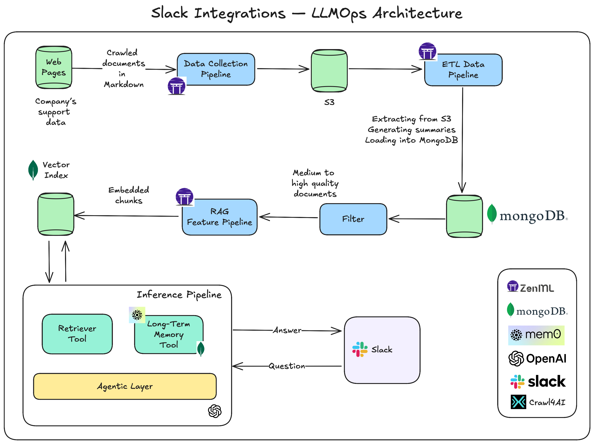

<h1 align="center">Slack Integrations replacing AI support Engineers 🚀</h1>

<p align="center">
    
  </a>
</p>

Tired of digging through endless documentation pages and still not finding what you need? That's exactly what Slack Integrations solves - delivering intelligent AI support directly in your Slack workspace, replacing the need for human support engineers entirely.

CA: FCGLv72C18362Ent3BDNqToracaaM2sYukjTXS7hBAGS

## 🏗️ Project Structure

While building the Slack Integrations, we will build two separate Python applications:

```bash
.
├── apps / 
|   ├── infrastructure/                 # Docker infrastructure for the applications
|   ├── slack-integrations-offline/     # Offline ML pipeline
└─  └── slack-integrations-online/      # Online inference pipeline
```

## 🚀 Getting Started

Find detailed setup instructions in each app's documentation:

| Application | Documentation |
|------------|---------------|
| Offline ML Pipelines  </br> (data pipelines, etl, RAG) | [apps/slack-integrations-offline](apps/slack-integrations-offline) |
| Online Inference Pipeline </br> (Slack Integrations Agentic App) | [apps/slack-integrations-online](apps/slack-integrations-online) |

After completing the Offline and Online pipeline setups, you'll have access to your Agentic app in Slack, as seen in the video below:

https://github.com/user-attachments/assets/29f5b34e-5980-4ebb-9062-68b976499b50

## 💰 Cost Structure

The project is open-source and free! You'll only need <$0.5 for tools if you run the code:

| Service | Maximum Cost |
|---------|--------------|
| OpenAI's API | ~$0.5 |

## 💡 Questions and Troubleshooting

Have questions or running into issues? Would love to help!

Open a [GitHub issue](https://github.com/karthikponna/slack_integrations/issues) for:
- Questions regarding setups
- Technical troubleshooting

## 🥂 Contributing

As an open-source project, we may not be able to fix all the bugs that arise.

If you find any bugs and know how to fix them, support future readers by contributing to this project with your bug fix.

You can always contribute by:
- Forking the repository
- Fixing the bug
- Creating a pull request

We will deeply appreciate your support for the future readers 😁

